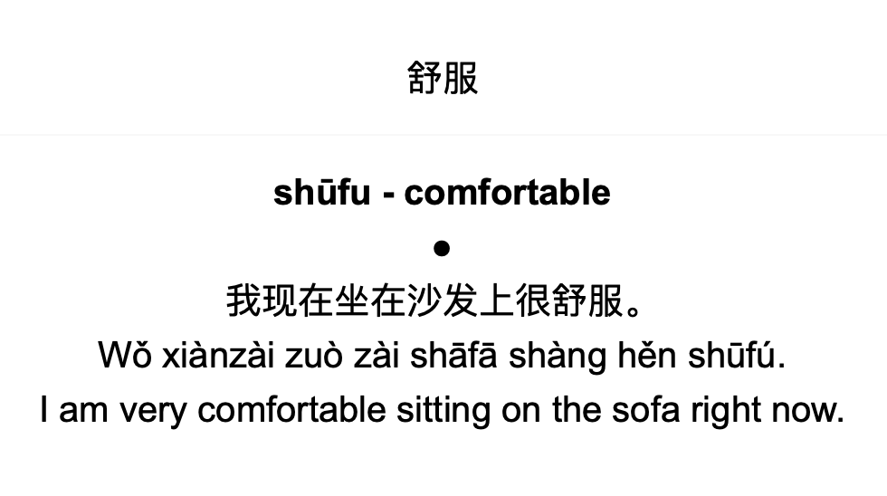

## Why automatically generate flashcards?

When studying for the Chinese language proficiency tests, HSK-1 and HSK-2, I found that I was spending far too much time on creating flashcards — often around 5–10 minutes per flashcard. From looking up the definition of the word, getting the pinyin with the right tones, ensuring correct formatting of the card, and coming up with an example sentence, particularly with limited understanding of Chinese to begin with, this was extremely challenging. Moreover, when I checked the cards with a native Chinese speaker, there would still be mistakes and strange wordings present. I found that I was spending more time creating flashcards than actively studying the language.

I figured many of these issues could easily be solved by leveraging AI to generate the decks. In the same amount of time it would take to finish the HSK-1 flashcard deck, I could code up my own flashcard making assistant. This assistant would allow me to quickly tailor the examples to my interests and needs, and quickly change the format and information on the flashcards as my learning needs changed.

Enough about the why, and let's look at the how. The code itself is quite simple, consisting of less than 150 lines of documented code which you can find over on my [GitHub](https://github.com/FinnHB/GenerateAnkiDeck). The process of generating the flashcards can be broken down into three simple steps:

1. Getting a list of words which you want to learn
2. Design an appropriate prompt and flashcard templates based on your needs
3. Feed the words into ChatGPT using the prompt template and use the output to populate the flashcard template

There are a few bits and bobs around these steps, such as setting up the communication with ChatGPT and learning how to create decks with [genanki](https://github.com/kerrickstaley/genanki). The essence of the code really boils down to the templates, as these are what fundamentally capture your specific query and needs.

## Get a list of words which you want to learn

First step is getting the list of words which you want to learn. This was fairly straightforward as I was able to pull the HSK vocabulary directly from the web using a dataset put together by [lemmih](https://github.com/lemmih/lesschobo/tree/master/data).

```python
import pandas as pd

hsk_level = 1
wordlist_file = f"https://raw.githubusercontent.com/lemmih/lesschobo/master/data/HSK_Level_{hsk_level}_(New_HSK).csv"

word_df = pd.read_csv(wordlist_file, index_col=0, header=1)

mask = [str(x)[0] == str(hsk_level) for x in word_df["HSK \nLevel-Order"]]
words = word_df.loc[mask, "Word"].values
```

## Design prompts

### Flashcard template

For the flashcard template, we can follow the guidance from the [genanki](https://github.com/kerrickstaley/genanki) repo. The flashcard templates can be tinkered with through HTML and custom CSS. When designing the template there were a few things which I wanted:

##### Front of card
- Only the character for the word which I wanted to learn with no pinyin

##### Back of card
- Pinyin of the word
- The English definition of the word
- An example sentence in Chinese with the pinyin and an English translation

The design adopted looks something like this:



The code for the card template can also be found in the [GitHub repo](https://github.com/FinnHB/GenerateAnkiDeck/blob/main/Scripts/genanki_model_templates.py).

### Prompt template

For the ChatGPT prompt, I needed to make sure that relevant information to fill out the flashcard template was returned and in a standardised format. To ensure that the definition of the word was clear, I ran two separate queries: one to extract the definition of the word, and another to formulate the example sentence.

```python
word = "舒服"

gpt_translate_context = 'You are a Chinese to English dictionary, providing concise translations. You only return the translation and pinyin.'
gpt_translate_query = word

gpt_sentence_context = 'You are a helpful assistant that is helping an English speaker to learn Chinese. Try to use simple words in the HSK1 to HSK3 vocabulary lists.'
gpt_sentence_query = f'Create a short example sentence in Chinese that uses "{word}". Include the translated sentence, the pinyin, and english translation, each separated by a new line.'
```

The above prompts could further be tweaked and improved, however, I found these to be sufficient for my use-case for now.

## Run query and generate deck

Once the templates are generated, the rest of the process is relatively trivial. Simply set up the connection with ChatGPT through the preferred method (note that you will need a ChatGPT API key). If you created the prompt templates directly in the code, they can be easily populated using `.format` or through the use of Python's [f-strings](https://realpython.com/python-f-strings/).

Depending on how good your prompts are and the format of your flashcards, you may need to conduct some cleaning on the ChatGPT output before passing it to the Anki deck. Once all the words in the list are iterated through and generated, you're golden — just save the Anki deck and import the `.apkg` file into Anki.

### When automatically generating Anki decks may or may not work

I have found generating these Anki decks for language learning to be extremely useful. If I get bored of a set of examples, I can simply re-generate them. I can also take note of words I come across day-to-day and quickly generate a deck to revise those words. Furthermore, instead of spending lots of time coming up with example sentences, I can ask ChatGPT to create examples that limit the vocabulary to HSK-1 to HSK-3.

Using ChatGPT is a great tool for language learning since a lot of language learning is relatively standard. The definitions of words don't change too much, and coming up with example sentences is not a very hard task. Where this may become more problematic is if you're relying on ChatGPT for factually correct information, e.g. if you need to study for an exam. In these instances, tools such as this should be approached with caution.

### Future avenues of improvement

The main area of improvement will be around refining the prompts and the card template for given needs. However, there are many new additions which I may look at in the future. For one, we could look at generating AI images based on the example sentences — as AI generated images can often be a bit quirky, they may provide a really good mental anchor for remembering a specific word. Additionally, one of the lacking features I have found with the current deck is that I cannot listen to the pronunciation of words. Adding such a feature may be beneficial, particularly for language learning. I also think it would be interesting to see if I can find a way to break down the characters to their fundamental radicals to help get a better understanding of the word in context to other words.

Feel free to clone my repo over on GitHub and ask away if there are any questions! The code is currently set up for learning Chinese, however, with a bit of tinkering it should be easy enough to adjust for any language or other learning endeavours.

---

<small>Feature image source: [unsplash.com](https://unsplash.com/photos/green-leafed-plant-beside-grey-concrete-post-chUBwfq-IlA) &nbsp;|&nbsp; Views are my own and do not reflect the views of my employer.</small>
