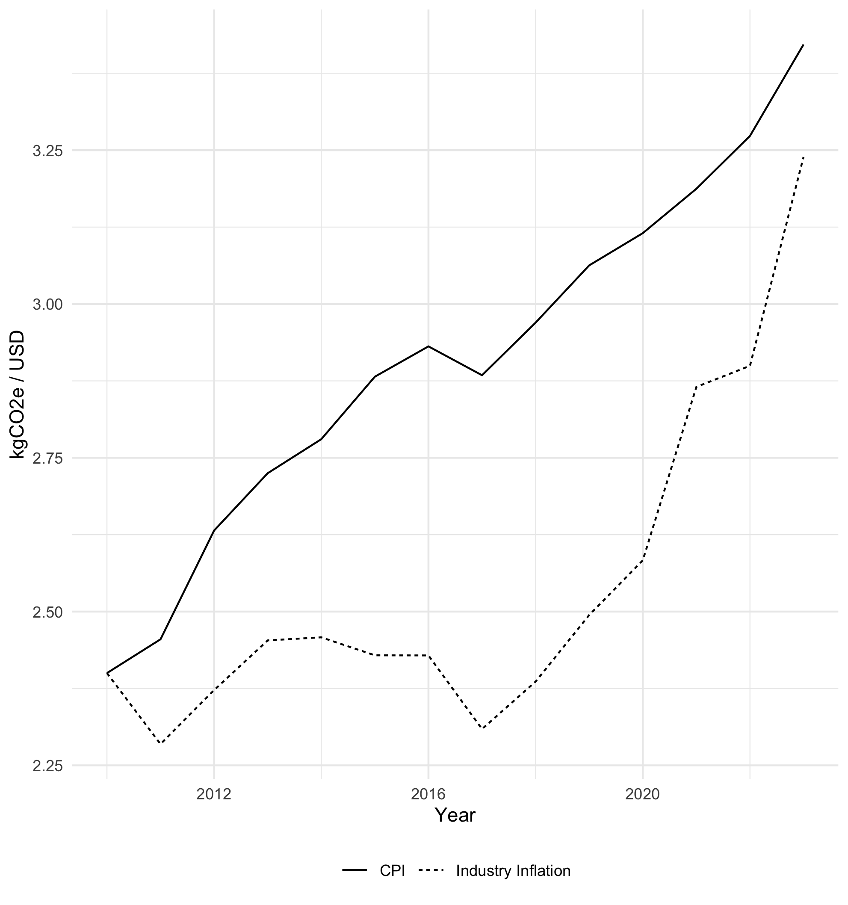
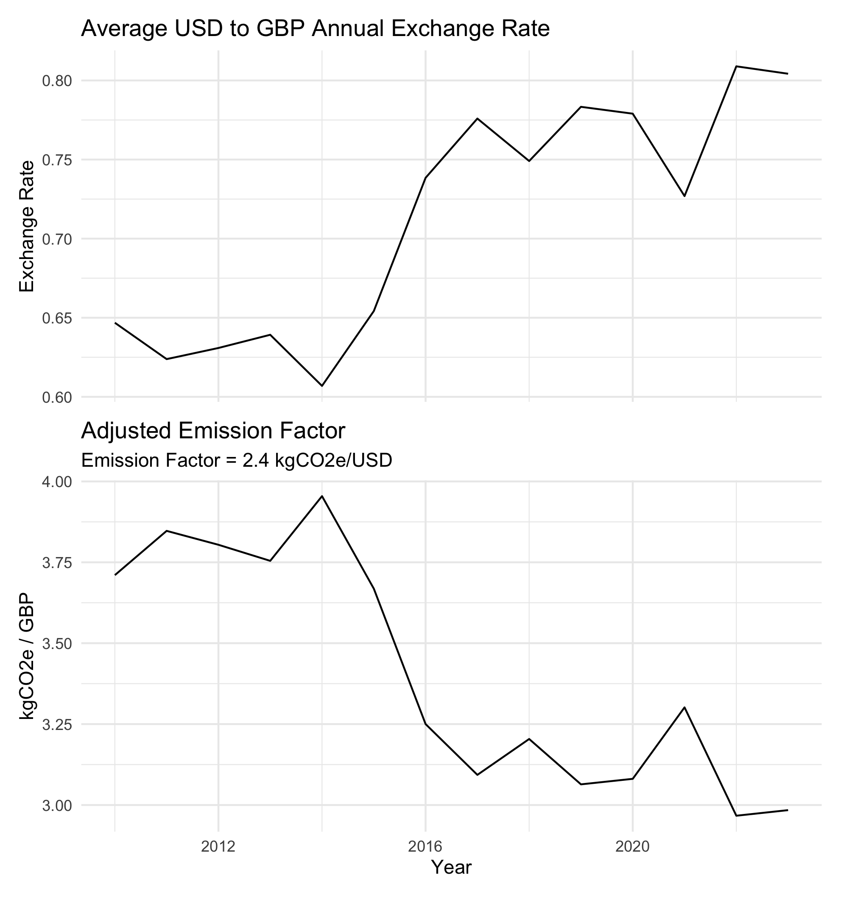
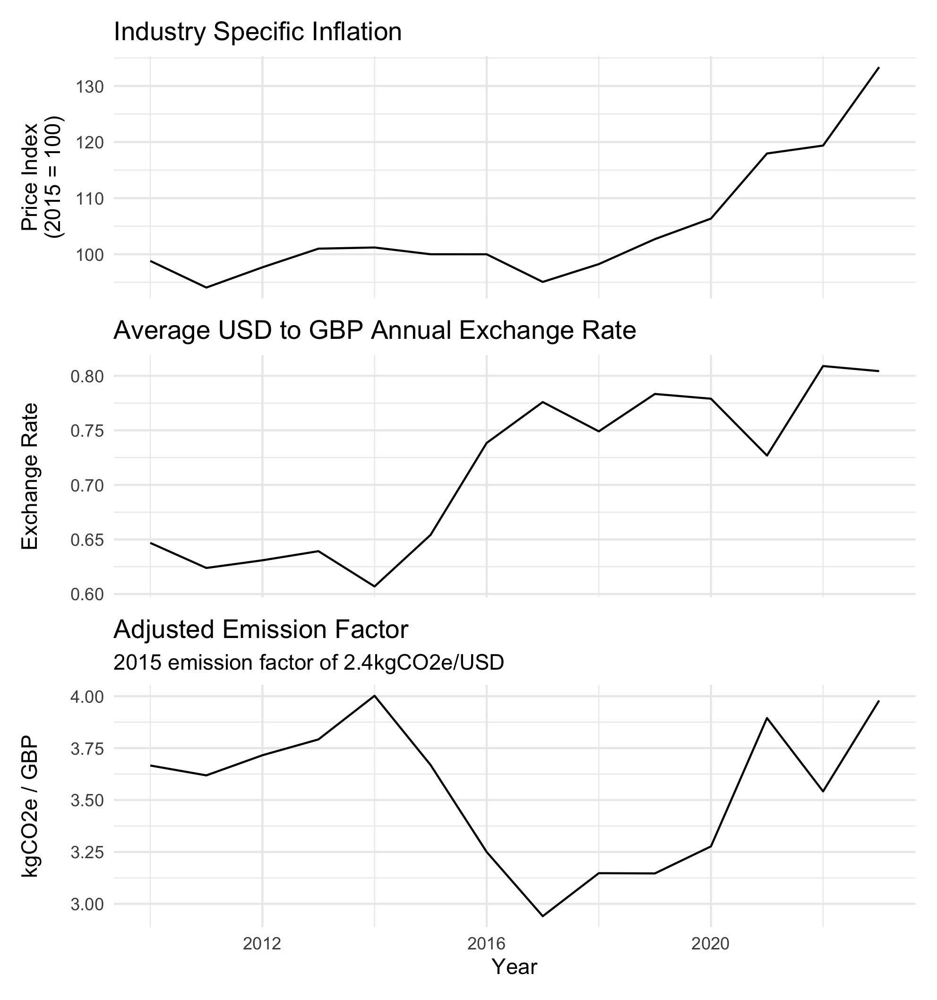

This blog post is a follow-on post from the previous [introduction to spend-based emission factors](/blog/spend-ef-intro), if you are not familiar with spend-based emission factors or simply want a refresher, I would recommend reading that post first. This post will be diving deeper into the underlying assumptions of spend-based emission factors and some of the key considerations when using them across regions and time periods. This post will primarily be focusing on spend-based emission factors derived from Environmentally Extended Input Output (EEIO) models, however, many of the principles will still apply to commodity price spend-based emission factors.

# EEIO Assumptions

EEIO models derive the spend-based emission factors by cascading and weighting industry relationships throughout the supply chain and multiplying them by the average industry emission intensity for a given commodity. The benefit of using this type of model is that we can capture the whole supply chain (theoretically to infinity) and we avoid double counting, as emission factors are directly linked to the total amount of emissions in the given economy. The term "the given economy" is important here, as for when we are dealing with EEIO models, we are only dealing with one region. Imports and exports are superficially captured, with the assumption that imports face an identical production function and carbon intensity of production as the main region. Thinking about this for more than a few seconds, one realizes that this is a very big assumption. The United States imports a large quantity of goods from China, however, the Chinese economy is very different from that of the US. Not only in terms of the goods and services that they produce, but also the energy mix, cost of labour, and methods of production. This means that for any US EEIO model, we are assuming that all the countries that export goods and services to the US are functionally identical to the US.

One way to get around this is to use a Multi-Region Environmentally Extended Input Output (MREEIO) model. These models augment an EEIO model by including the inter-industry and/or inter-commodity relationship between each region. Let's say we have an MREEIO model between the US, China, and the Rest of the World (RoW), if we wanted to calculate the emissions for one unit of agricultural output, we would trace the domestic industry inputs, Chinese industry inputs, and the RoW industry inputs through the supply chain. Through the MRIO, we can apply differentiated characteristics to each of the regions, capturing their unique economic characteristics as well as apply differentiated carbon intensities of production. So MREEIOs can solve our headache of imports and allow for much more accurate emission factors in this highly interconnected world, right? Well, the difficulty with MREEIO models is that we do not usually have the data of industry-by-industry trade flows between all regions, and even if we did, this data would seldomly be classified in the same way. Consequently, MREEIO models can become very large and complex to build, and more importantly, they often rely heavily on estimated numbers. In some instances, where institutional memory is not retained or the models are not appropriately documented or maintained, new data will often be estimated based on previously estimated legacy data as if the legacy data is the truth. The impact of this is that MREEIO models can often give the impression of a detailed and accurate model, with a flurry of hidden assumptions and questionable numbers running in the back-end.

This leaves us in a bit of a predicament. We can choose between (i) a model which assumes all countries are the same, but we know the limitations, assumptions, and what has gone into the model or (ii) a model which allows for regional heterogeneity but often relies heavily on estimated data which impose their own (often hidden) assumptions. Personally, I would favour the first option. A model should aim to provide a "good" guess given a series of clearly defined conditions. To maintain integrity and promote high data quality, we should aim to be transparent with the assumptions that we make, understand our source data, and be upfront about data availability; models should be used as a tool to help make informed guesses, not to dazzle, impress, and give a false sense of security. The carbon accounting space is currently leaning towards the second option of MREEIOs as the perceived increased detail that these models provide is appealing to firms. An increase in the number of available regional or product specific emission factors are often erroneously associated with more accurate and tailored footprints.

# Emission factor adjustments

As we now know, the region that the spend-based emission factors is derived from is important. However, if you don't have spend-based emission factors for the region or time-frame, certain adjustments can be made to make them more representative. However, you should always be mindful of the quality of the original emission factors as well as differences in the regional and industry context.

### Exchange Rate Adjustments
As a general principle, we want to match the adjustments to the emission factor as closely as possible to the given commodity that we're trying to adjust for. 

**Like-for-like price comparison** for a specific commodity would be the most accurate spend-based emission factor adjustment method. This would be where we know that the relative price of a specific commodity in two different locations. For example, if we know that the cost for some unknown quantity of bricks, x, is 20% higher in the US compared to the UK when adjusting for purchasing power, then we can adjust the UK emission factor by first applying the current exchange rate and then applying the purchasing power adjustment. As the emissions associated with bricks inherently come from the quantity of bricks, as opposed to the price of bricks, the purchasing power adjustment on top of the exchange rate adjustment results in a more accurate estimation of the underlying activity that results in the emissions. There is no set way of applying the purchasing power adjustment, however, on way may be to look at the prices relative to the median income. If we know that the unknown quantity, x, of bricks in the UK costs 1% of median income and in the US, the same unknown quantity costs 2% of median income, then we may determine that the purchasing power in the US is 50% lower than that of the UK. Consequently, after the exchange rate conversion, we would also want to halv the emission factor since the equivalent amount of USD to GBP can only buy half the amount of bricks.

This naturally comes with a few caveats.
- First, and arguably the biggest one, if we have relative price information to this level of detail, usually we would have enough price information to proxy a quantity of a specific commodity that has been bought and avoid the need for using a spend-based emission factor.
- May involve "double-counting" where the exchange rate is heavily influenced by the price of a given commodity and the domestic pricing effects are asymmetrical. For example, the value of the Norwegian Kroner (NOK) is heavily influenced by oil prices, with the value of NOK often rising with oil prices. The value of the Philippine Peso (PHP) may be less influenced by oil price, but domestic prices are heavily influenced due to high reliance on oil. Consequently, if we convert a spend-based emission factor from tCO2e/PHP to tCO2e/NOK, the exchange rate already captures part of the price effects. 

However, it is generally very unlikely that there would be sufficiently detailed relative price information. This would be where we would look at the price of a given commodity and adjust the emission factor in accordance with the PPP of that given commodity. For example, if an apple in the UK costs GBP 1 and costs 2

- Second best would be an industry-level adjustment (potentially PPP adjusted)
- Third is a general exchange rate adjustment; PPP adjustment will on average take us closer to the actual unit price adjustment than just using CPI. Note that PPP can be distortionary if the good or service being footprinted is unlikely to be a representative good/service within the classification.
- Overall the purpose of exchange rate adjustment is to get the closest quantity unit equivalence across two regions/currencies.

### Inflation

- Best is commodity-specific inflation at current prices
- Second best is industry-specific inflation at current prices
- CPI inflation can be used, however, be aware of potential distortionary effects
- Lack of adjustments leads to increasingly "incorrect" numbers over time

### Rebaselining

Note that numbers are constantly changing and that rebaselining will likely be necessary as new data becomes available or emission factors are updated. Rebaselining is a normal activity and EEIO and MREEIO emission factors are likely to be volatile, in part due to the extrapolation as well as temporal and currency conversions which may impact the numbers over time. These adjustments, although on average representative for inter-regional and temporal changes, may not always be an accurate reflection of how a company's average costs have changed over time. This can result in either increases or decreases in emissions of a company, without them doing anything. This can be a difficult message to convey, especially when management are making large decisions to reduce their scope 3 based on outcomes from highly questionable numbers.

---

<small>Feature image source: [unsplash.com](https://unsplash.com/photos/macro-shot-of-gray-and-white-birds-IChRBaP9gTY) &nbsp;|&nbsp; Views are my own and do not reflect the views of my employer.</small>
